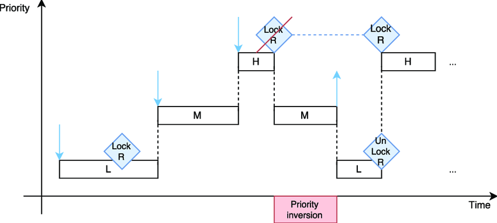

# 1980-CACM-Mesa

ShortName: Mesa
Conference: CACM
FullName: Experience with processes and monitors in Mesa
Tag: CS736
Year: 1980

### Changes from Hoare

- Calling `signal` can wake any thread
- Nor it is required to run new woke thread immediately
- Not guaranteed that condition is full filled after waking up
- Need a while loop to recheck the condition

### Changes in interfaces

- Hoare: queue length interface
- Hoare: priority of sleeping threads
- Mesa: has `broadcast` and `notify_all`
- Mesa: has `timeout` of sleep, handle exception

### Naked Notify

- Notification-Wait without lock/monitor
- Monitor ensured: lock released after wait begins, then someone can notify
- Naked notify: context switch while waiting to sleep, someone else notified in the middle of going to sleep, missed the notification
- Need something to remember a notification happened
- Use binary semaphore

### Priority Inversion



- A low-priority thread indirectly blocking high-priority thread
- Thread L holds lock R
- M is stopping L from executing
- Lock R is unreleased, H is blocked

**Solution: Priority Inheritance**

- Boost priority of a thread that is blocking a high-priority job
- Since H is waiting on R
- Set priority of L be same as H

Static: Do it before H is waiting. Prediction.

Dynamic: Do it after H is waiting. Reactive.

Solution: Lottery Scheduling

### Nested Monitor Wait

```
monitor M {
	monitor N {
		wait()
	}
}
```

Solution:

1. Ordered locking: always lock M and then N
2. Release both M and N
    1. maintain data consistency before releasing M
3. Split outer monitor

```
M1 {
}
N {
}
M2 {
}
```