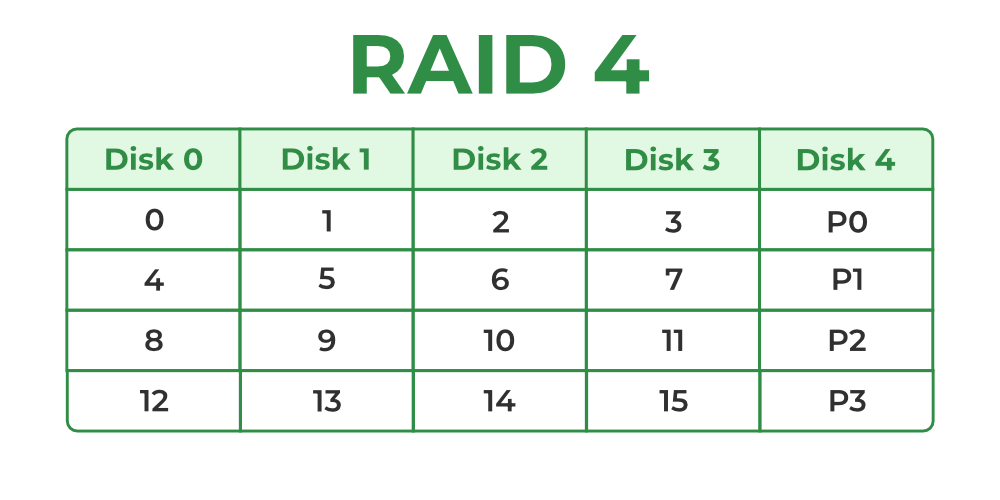
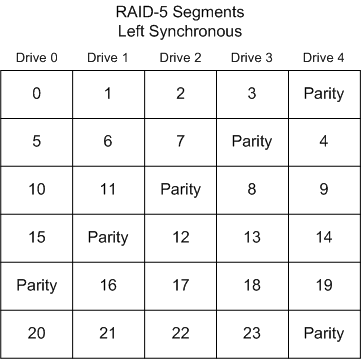

# 1988-SIGMOD-RAID

ShortName: RAID
Conference: SIGMOD
FullName: A Case for Redundant Arrays of Inexpensive Disks (RAID)
Tag: CS736
Year: 1988

### Motivation

- Growing performance gap between CPU+Memory and storage
- Storage is bottleneck
- Need for reliability and scalability

### RAID Levels

- RAID-0: Striping (e.g. blocks in multiple disks)
- RAID-1: Mirror disks
- RAID-3: Single parity disk.

### RAID-0

- Chunk size: how many consecutive logical blocks in same disk

### RAID-1 (10)

### RAID-4

- Write to block:
    - Subtractive approach (changed block + parity) to calculate new parity
    - Two reads and writes
- Bad for random write.
- Good for sequential I/O, Good match for WAFL

### **RAID-5**

- Not a single parity disk anymore, bottleneck of `rand-write` alleviated
- Left symmetric: last to first parity assignment. Wraps to last disk.

### Compare

- N disks
- D latency per disk
- C capacity per disk
- S sequential throughput per disk (Read S, write S’)
- R random throughput per disk (Read R, write R’)

|  | Capacity | Latency (read) | Latency (Write) | Min Disk Failure | Throughput (seq-read) | Throughput (seq-write) | Throughput (rand-read) | Throughput (rand-write) |
| --- | --- | --- | --- | --- | --- | --- | --- | --- |
| RAID-0 | NC | D | D | 0 | NS | NS’ | NR | NR’ |
| RAID-10 | NC/2 | D | D | 1 | NS/2  or N/S | NS’/2 | NR | NR’/2 |
| RAID-4 | (N-1)C | D | 2D | 1 | (N-1)S | (N-1)S’ | (N-1)R | ~ R/2 |
| **RAID-5** | (N-1)C | D | 2D | 1 | (N-1)S | (N-1)S’ | NR | ~ NR/4 |