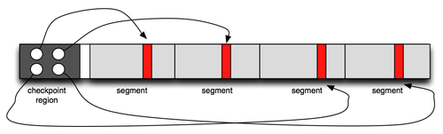

# 1992-TOCS-LFS

ShortName: LFS
Conference: TOCS
FullName: The design and implementation of a log-structured file system
Tag: CS736
Year: 1992

### Motivation

- Sequential I/O popular cause RAID-5
- Copy on write
- Memory high, read performance better cause large cache
- Seek is a bottleneck (avoid it)

### LFS Strategy

- Buffer in memory, until buffer filles or `fsync`
- **Segment** is a log (no block?)

<aside>
💡

In ext4, inodes are in fixed position in disk

In FFS, imap is in fixed first location

In LFS, imap is at the end of log

</aside>

### IMAP

- In memory, periodic flush

### Segments

- Hold many blocks, imap, inode
- Imap for every segments
- Garbage collection per segment

### Crash Recovery

- Point to all imaps
- only the most recent part of the log needs to be examined to restore consistency, faster

### Checkpoint region

- Multiple imaps, checkpoint points to all
- Active imaps caches in memory

### Garbage Collection (Segment Cleaning)

- Copy valid blocks to new segment, declare old segments as free

### Segment Summary

- At the end of segment, we have metadata of this segment
- For each block, which inode it is part of, and offset of the inode it’s part of

### Which segment to clean

- Wait for hot segments (they will free up fast on its own)

### LFS Advantage:

- Good for many small writes
- Temporal locality, good random write, good re-read
- Good for versioning (keeping old blocks)

### LFS Disadvantage

- Sequential read is bad, blocks are scattered (but cache may save the day)

### Tidbits:

WAFL ⇒ Write Anywhere FS