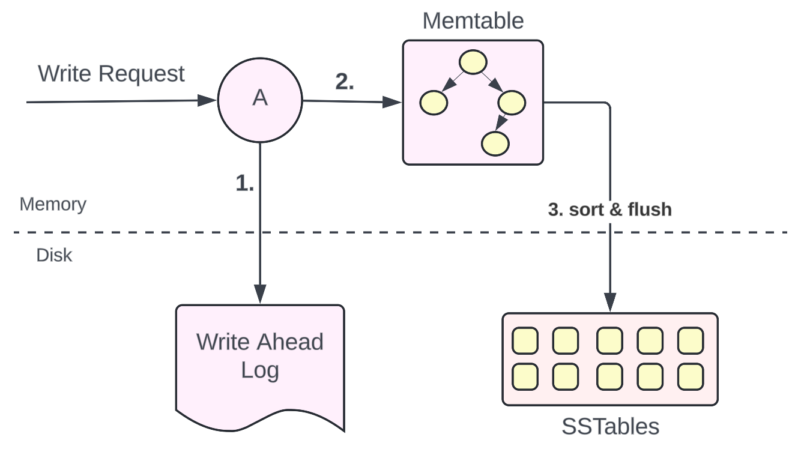
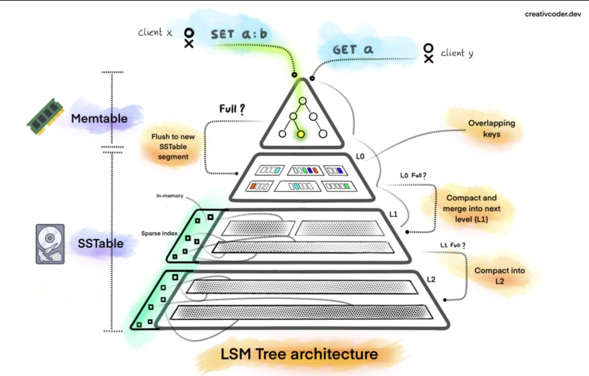

# 1996-ActaInfo-LSMTree

ShortName: LSMTree
Conference: ActaInfo
FullName: The log-structured merge-tree (LSM-tree)
Tag: CS736
Year: 1996

### Purpose

- Handing high amount on insert and deletes
- Updating B-tree on-the-fly ⇒ random IO on disk
- Reducing disk I/O, buffering updates in memory

### Overview

- Incoming writes are buffered in memory
    - Memtable - balanced binary tree
- Memtable flushed to disk in a sorted segment
    - SSTables
- Updates
    - Update to key is put to new SSTables
    - Delete key marked as tombstone
    - Only recent key is valid

- Too many SSTables
    - Periodic merge and compaction
- Non-existent key search
    - Bloom filter at each level/SSTable to mitigate exhaustive search