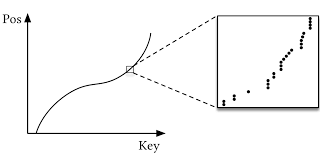
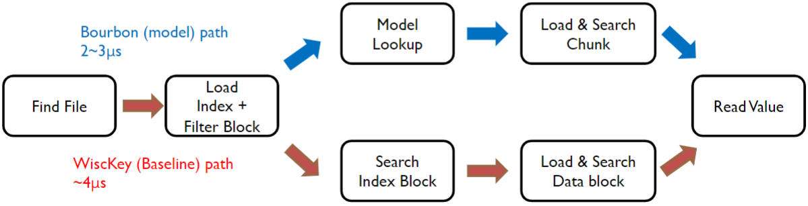

# 2020-OSDI-Bourbon

ShortName: Bourbon
Conference: OSDI
FullName: From WiscKey to Bourbon: A Learned Index for Log-Structured Merge Trees
Tag: CS736, DB
Year: 2020

[1996-ActaInfo-LSMTree](1996-ActaInfo-LSMTree%201237db6fa1f7808a896ed6bdc59560bb.md) 

[2016-FAST-WiscKey](2016-FAST-WiscKey%201237db6fa1f78087a611cb33919c7dee.md) 

### Background - Learned Indices (Kraska et. al)

- Learn the offset of a key in sorted keys
- Very fast, low space
- Difficult if distribution changes (Write-heavy workload)
- Need to re-learn

### Motivation

- In LSMTree, SSTables are immutable
- Learning index within SSTable will work for the entire lifetime of that SSTable

### Lifetime of SSTable

- No need to learn index if SSTable dies shortly, empirical study
- Lifetime of SSTable in L0 ⇒ 10 sec
- Lifetime of SSTable in L1 ⇒ 1 hour
- Wait shortly (1 sec) before learning
- Don’t ignore L0, L1 ⇒ are used more frequently

### Learning

- Piecewise linear functions for a key distribution
- WiscKey only has key, easier to learn
- LevelDB, value size throws off prediction

### Cost benefit

- Learn estimated benefit
    - Baseline path lookup time x
    - Model path lookup time y
    - Number of lookups served m
    - (x - y) * m